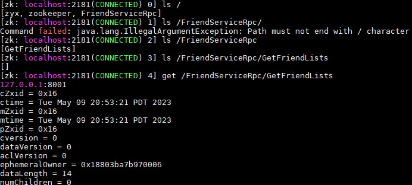

# zrpc

基于muduo，zookeeper，protobuf 实现的分布式网络通信框架

- 服务注册/服务发现/zookeeper CS端的使用，封装c api
- 异步日志/读取配置
- 自定义消息格式(定长标识不定长长度)
- 基于protobuf的rpc实现原理 service/method/stub/rpcchannel

```bash
bin：可执行文件
build：项目编译文件
lib：项目库文件
src：源文件
test：测试代码
example：框架代码使用范例
CMakeLists.txt：顶层的cmake文件
README.md：项目自述文件
```

# build

```bash
mkdir build
cd build 
cmake ..
make 

# bin 目录下 发布friend/user服务到zk
./friend -i friend.conf
./user -i user.conf

./consumer -i xxx.conf # 发起两次远程调用
```


# ENV

ubuntu 20/zookeeper-3.4.10.tar.gz/muduo最新版本/protobuf3.6.0

```bash
编译zk c api时注意, 直接忽略警告
./configure CFLAGS="-g -O2 -Wno-error"

./zkServer.sh start-foreground #前台启动zk
./zkClie.sh
```

